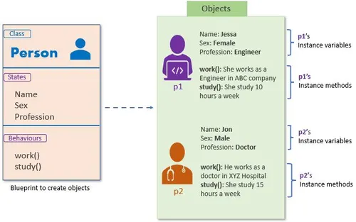
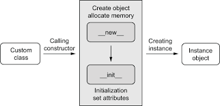
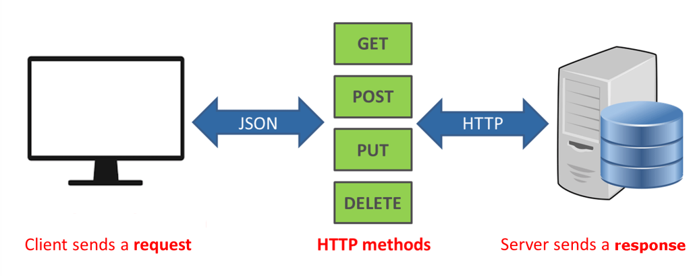
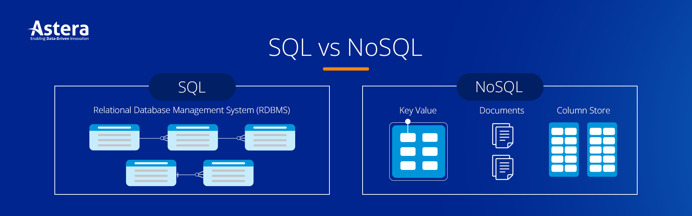
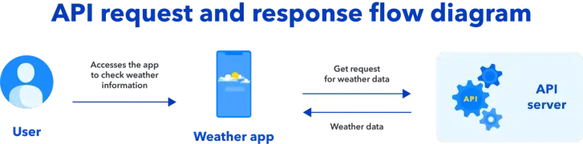
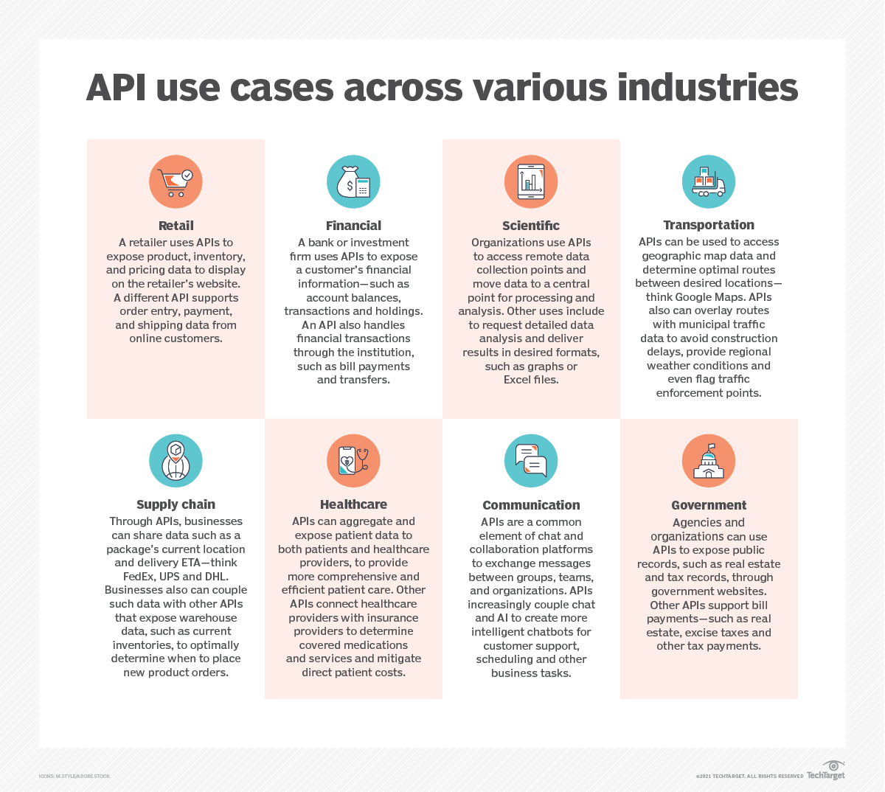
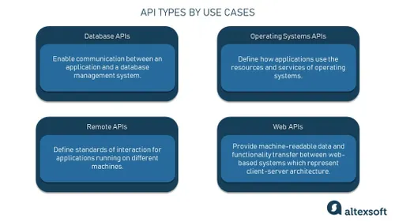
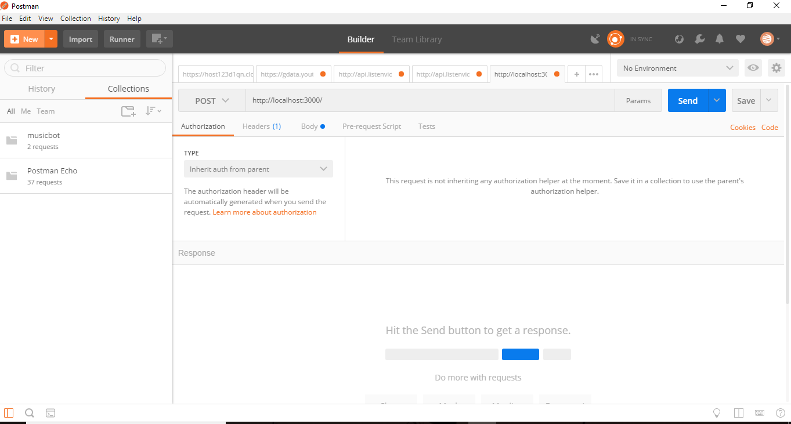
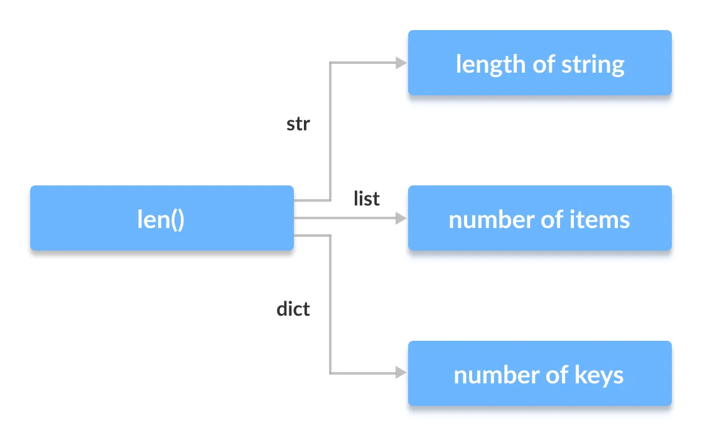
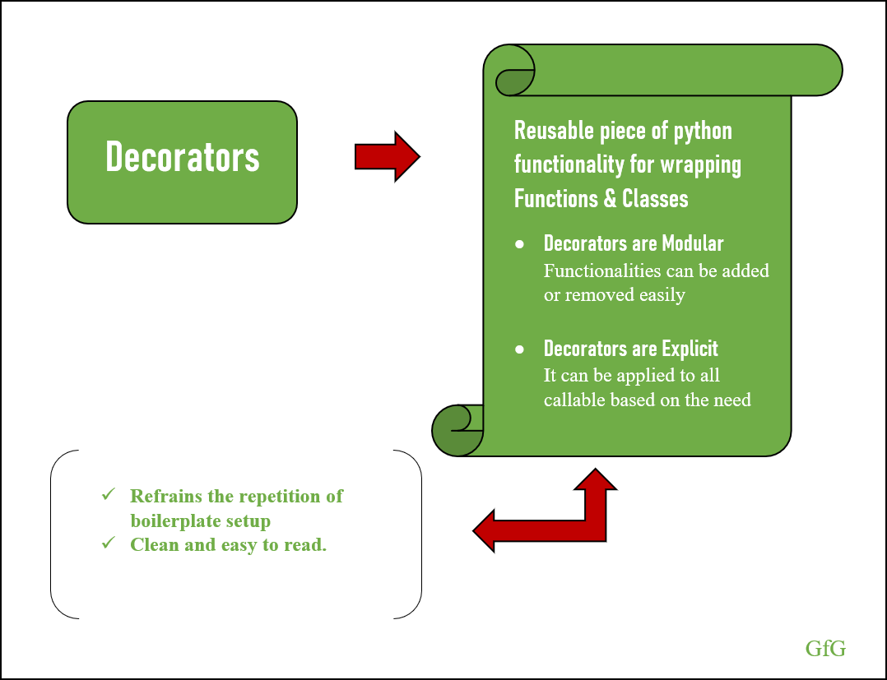

## 1- Para qué usamos Clases en Python?  

Las clases en Python se utilizan para organizar el código y estructurarlo mejor, especialmente cuando un programa empieza a crecer. Permiten agrupar datos (atributos) y funciones (métodos) dentro de una misma entidad, lo que facilita entender, mantener y reutilizar el código.  

> Una clase es básicamente una plantilla a partir de la cual se crean objetos. La imagen siguiente hace una representación de esto. Puedes >crear cuantas plantillas quieras cada una con sus propios atributos y respuestas dependiendo de los datos introducidos al crear la variable.  
  
<br/><br/>
<div align="center">
    
</div>
<br/><br/>
- Un uso importante de las clases es modelar el mundo real dentro del programa. Puedes crear clases como Coche, Producto, Usuario, etc. Esto hace que el código sea más intuitivo porque representa cosas que ya entendemos.  
  
- También permiten reutilizar código. En lugar de repetir variables y funciones para cada entidad, creas una clase y luego generas múltiples objetos con diferentes valores. Esto reduce errores y hace el código más limpio.  

- Otro concepto importante es la encapsulación, que consiste en controlar cómo se accede a los datos. Por ejemplo, puedes evitar que alguien modifique directamente un valor y obligarlo a usar métodos específicos.  

- Las clases también permiten la herencia, que consiste en crear nuevas clases basadas en otras. Esto ayuda a reutilizar código y extender funcionalidades sin duplicar lógica. Además, existe el polimorfismo, que permite que diferentes objetos respondan al mismo método de formas distintas.  

En general, las clases son clave cuando quieres escribir programas más grandes, organizados y escalables.  

Ejemplo  de una clase:  

```
class Coche:
    def __init__(self, marca, modelo):
        self.marca = marca
        self.modelo = modelo

    def arrancar(self):
        print("El coche está arrancando")
mi_coche = Coche("Toyota", "Corolla")
mi_coche.arrancar()  
```  

Ejemplo de encapsulación:  
```
class Cuenta:
    def __init__(self, saldo):
        self._saldo = saldo

    def depositar(self, cantidad):
        self._saldo += cantidad

    def mostrar_saldo(self):
        return self._saldo
cuenta = Cuenta(1000)
cuenta.depositar(500)
print(cuenta.mostrar_saldo())  
```  

Ejemplo de herencia:  
```
class Animal:
    def hacer_sonido(self):
        print("Sonido genérico")

class Perro(Animal):
    def hacer_sonido(self):
        print("Guau")
mi_perro = Perro()
mi_perro.hacer_sonido()  
```
Ejemplo de polimorfismo:  
```
class Gato:
    def sonido(self):
        print("Miau")

class Perro:
    def sonido(self):
        print("Guau")

def hacer_sonido(animal):
    animal.sonido()

hacer_sonido(Gato())
hacer_sonido(Perro())  
```
En resumen, las clases se usan para organizar, reutilizar y estructurar el código, especialmente cuando trabajas con programas complejos o quieres representar objetos del mundo real dentro de tu aplicación.

## 2- ¿Qué método se ejecuta automáticamente cuando se crea una instancia?  

En Python, el método que se ejecuta automáticamente cuando se crea una instancia de una clase es init. Este método es conocido como el “constructor” de la clase, aunque técnicamente el verdadero proceso de creación del objeto ocurre antes (en new), pero en la práctica init es el que se usa para inicializar los atributos del objeto recién creado.  


<br/><br/>
<div align="center">
    
</div>
<br/><br/>

Cuando se crea un objeto, Python realiza internamente varios pasos. Primero, lo genera en la memoria y luego llama al método init de la clase para inicializarlo. Este método recibe como primer parámetro self, que hace referencia a la propia instancia, y después cualquier argumento adicional que hayas definido.  

Ejemplo básico:  

```
class Persona:
    def init(self, nombre, edad):
        self.nombre = nombre
            self.edad = edad
```  

Si no defines un método init, Python proporciona uno por defecto que no hace nada, pero permite que la instancia se cree sin errores.  
También puedes usar valores por defecto en init:  

```
class Coche:
    def init(self, marca="Desconocida", año=0):
        self.marca = marca
        self.año = año
c1 = Coche()
c2 = Coche("Toyota", 2022)

```  
Aquí, c1 tendrá valores por defecto, mientras que c2 tendrá los valores proporcionados.  

En resumen, el método que normalmente se ejecuta automáticamente al crear una instancia en Python es init, y se utiliza para configurar el estado inicial del objeto mediante la asignación de atributos y otras operaciones de inicialización.  


## 3- ¿Cuáles son los tres verbos de API?
Los tres verbos principales de API son:  

GET -> Obtener datos    

POST -> Crear datos  

PUT -> Actualizar datos  

> Estos “verbos” indican qué acción quieres realizar sobre un recurso en un servidor. 

<br/><br/>
<div align="center">
    
</div>
<br/><br/>

- GET se utiliza para obtener información. Es el método más común y no debería modificar datos en el servidor, solo recuperarlos. Por ejemplo, si tienes una API de usuarios, podrías hacer una petición GET a /usuarios para obtener la lista de todos los usuarios, o a /usuarios/5 para obtener el usuario con ID 5. Un ejemplo en código usando Python con requests sería: 

```
import requests
respuesta = requests.get("https://api.ejemplo.com/usuarios/5")
print(respuesta.json())
```  

- POST se utiliza para crear nuevos recursos en el servidor. Cuando envías una petición POST, normalmente incluyes datos en el cuerpo de la solicitud, y el servidor los usa para crear algo nuevo. Por ejemplo, crear un nuevo usuario:  

``` 
import requests
datos = {"nombre": "Ana", "edad": 30}
respuesta = requests.post("https://api.ejemplo.com/usuarios", json=datos)
print(respuesta.status_code)  
```
- PUT se utiliza para actualizar un recurso existente (o reemplazarlo completamente). A diferencia de POST, que crea algo nuevo, PUT se usa cuando ya sabes qué recurso estás modificando. Por ejemplo, actualizar el usuario con ID 5:  
  
```
import requests
datos = {"nombre": "Ana López", "edad": 31}
respuesta = requests.put("https://api.ejemplo.com/usuarios/5", json=datos)
print(respuesta.status_code)
``` 
> Aunque muchas veces se habla de estos tres como los principales, en realidad existen más verbos HTTP importantes en APIs,
> como DELETE(para eliminar recursos) o PATCH (para actualizaciones parciales). Sin embargo, GET, POST y 
> PUT son los más fundamentales para entender cómo funcionan la mayoría de las APIs REST: obtener datos, crear recursos y actualizarlos.  

## 4-¿MongoDB es SQL o NoSQL?
* MongoDB es una base de datos NoSQL. Esto significa que no utiliza el modelo relacional tradicional basado en tablas, filas y columnas como las bases de datos SQL (por ejemplo, MySQL o PostgreSQL), sino que emplea un modelo diferente para almacenar y gestionar la información.  

    - En concreto, MongoDB es una base de datos orientada a documentos. En lugar de tablas, utiliza colecciones, y en lugar de filas, utiliza documentos. Estos documentos están almacenados en un formato similar a JSON llamado BSON (Binary JSON), lo que permite guardar datos de forma flexible y con estructuras variadas. 

<br/><br/>
<div align="center">
    
</div>
<br/><br/>

Por ejemplo, en una base de datos SQL, podrías tener una tabla usuarios con columnas fijas como id, nombre y edad. Todas las filas deben seguir esa misma estructura:  

```
id | nombre | edad
1 | Ana | 30
2 | Luis | 25
```

En MongoDB, en cambio, los datos se guardan como documentos dentro de una colección, y cada documento puede tener una estructura diferente:  

```
{ "nombre": "Ana", "edad": 30 }
{ "nombre": "Luis", "edad": 25, "ciudad": "Madrid" }
```
  

Como puedes ver, el segundo documento tiene un campo adicional (ciudad), lo cual es perfectamente válido en MongoDB. Esta flexibilidad es una de las principales características de las bases de datos NoSQL.

- Otro ejemplo práctico usando MongoDB en JavaScript (con el shell o Node.js):
```
db.usuarios.insertOne({ nombre: "Carlos", edad: 28 })
```
Aquí estás insertando un documento en la colección usuarios.

Para consultar datos:
```
db.usuarios.find({ edad: { $gt: 25 } })
```
Esto devolvería todos los documentos donde la edad es mayor que 25.

En resumen, MongoDB es NoSQL porque no usa tablas relacionales ni lenguaje SQL tradicional, sino que trabaja con documentos flexibles en colecciones. Esto lo hace especialmente útil para aplicaciones donde los datos pueden cambiar de estructura con frecuencia o donde se necesita escalar horizontalmente de forma sencilla.

## 5- ¿Qué es una API?
- Una API (Application Programming Interface, o Interfaz de Programación de Aplicaciones) es un conjunto de reglas y mecanismos que permite que diferentes programas o sistemas se comuniquen entre sí. En lugar de que un software tenga que saber cómo está construido otro por dentro, utiliza la API como intermediaria para solicitar información o ejecutar acciones.

    - Las APIs funcionan normalmente mediante solicitudes (requests) y respuestas (responses). Un cliente (por ejemplo, una app o un navegador) envía una solicitud a un servidor a través de la API, y el servidor responde con los datos o el resultado de la operación.

<br/><br/>
<div align="center">
    
</div>
<br/><br/>


- Las APIs tienen una enorme variedad de usos en el desarrollo de software moderno, ya que permiten conectar sistemas, reutilizar servicios y automatizar procesos. Entender sus usos te ayuda a ver por qué son fundamentales en casi cualquier aplicación actual.  

> Uno de los usos más comunes es la integración entre aplicaciones. Por ejemplo, cuando una web permite iniciar sesión con Google o Facebook, en realidad está usando APIs de esos servicios. Tu aplicación envía una solicitud a la API de autenticación, recibe la confirmación del usuario y evita tener que gestionar contraseñas directamente. Esto simplifica el desarrollo y mejora la seguridad.  

<br/><br/>
<div align="center">
    
</div>
<br/><br/>  

- Otro uso muy frecuente es el consumo de servicios externos. Muchas aplicaciones no construyen todo desde cero, sino que utilizan APIs ya existentes. Por ejemplo, una app de viajes puede usar una API de mapas para mostrar ubicaciones, rutas o distancias. En lugar de desarrollar un sistema de geolocalización completo, simplemente hace peticiones a la API y obtiene los datos listos para usar.

- Las APIs también se utilizan para la comunicación entre el frontend y el backend. En una aplicación web moderna, el frontend (lo que ve el usuario en el navegador) no accede directamente a la base de datos. En su lugar, hace solicitudes a una API del backend.

<br/><br/>
<div align="center">
    
</div>
<br/><br/>  

- Además, permiten crear ecosistemas y plataformas. Empresas como Twitter, Stripe o Google ofrecen APIs públicas para que otros desarrolladores construyan aplicaciones sobre sus servicios. Por ejemplo, una tienda online puede usar una API de pagos para procesar transacciones sin tener que implementar todo el sistema financiero desde cero.

## 6- ¿Qué es Postman?

Postman es una herramienta de software que se utiliza para trabajar con APIs, especialmente para probarlas, explorarlas y desarrollarlas de forma sencilla. Es muy popular entre desarrolladores porque permite enviar solicitudes a un servidor sin necesidad de escribir mucho código, y ver las respuestas de manera clara y organizada. 

> En esencia, Postman actúa como un cliente de APIs. Esto significa que tú puedes construir una petición (por ejemplo, GET, POST, PUT o DELETE), enviarla a una API y analizar la respuesta que devuelve el servidor. Todo esto se hace desde una interfaz gráfica, lo que facilita mucho el proceso de pruebas.

Postman también permite organizar peticiones en colecciones. Esto es útil cuando trabajas con una **API grande**, ya que puedes agrupar todas las solicitudes relacionadas (usuarios, productos, pedidos, etc.) y reutilizarlas.

- Además, incluye herramientas para automatizar pruebas. Puedes escribir pequeños scripts (en JavaScript) para verificar automáticamente si las respuestas son correctas. Por ejemplo, comprobar que el código de estado sea 200 o que un campo exista en la respuesta.

Otro uso interesante es la *documentación*. Postman permite generar documentación automática de una API a partir de las colecciones, lo que facilita compartir cómo funciona con otros desarrolladores.  

Foto de ejemplo de la aplicacion:  
<br/><br/>
<div align="center">
    
</div>
<br/><br/>  

Como contrapartida hay que tener en cuenta que:

- **No sustituye un framework de pruebas completo:** aunque permite automatizar validaciones con scripts, Postman no reemplaza herramientas especializadas en pruebas unitarias, de integración o de frontend.  

- **Funciones avanzadas en versión de pago:** características como monitoreo extendido, reportes avanzados y mayor colaboración en equipo requieren licencias de pago.  

- **Dependencia de la aplicación:** en equipos con máquinas de bajos recursos, Postman puede volverse pesado al manejar colecciones grandes.  

- **Limitaciones en pruebas de performance:** aunque permite validar tiempos de respuesta básicos, para pruebas de carga o estrés se recomienda usar herramientas como JMeter o k6.  

- **Curva de organización en proyectos grandes:** sin buenas prácticas en el manejo de colecciones, entornos y variables, Postman puede volverse caótico a medida que crecen los escenarios de prueba.

## 7- ¿Qué es el polimorfismo?
 El polimorfismo es un concepto fundamental de la programación orientada a objetos que significa “muchas formas”. Se refiere a la capacidad de un mismo método, función u objeto de comportarse de diferentes maneras dependiendo del contexto o del tipo de datos con los que trabaja.

 <br/><br/>
<div align="center">
    
</div>
<br/><br/>  

- En términos simples, el polimorfismo permite usar una misma interfaz (por ejemplo, un mismo nombre de método) para realizar acciones distintas según el objeto que la esté utilizando. Esto hace que el código sea más flexible, reutilizable y fácil de mantener.

    - Uno de los tipos más comunes de polimorfismo es el polimorfismo por herencia (también llamado sobrescritura de métodos). Ocurre cuando varias clases heredan de una clase base y redefinen un mismo método con comportamientos diferentes.

    ```
    Ejemplo:

    class Animal:
        def hacer_sonido(self):
            print("Sonido genérico")

    class Perro(Animal):
        def hacer_sonido(self):
            print("Guau")

    class Gato(Animal):
        def hacer_sonido(self):
            print("Miau")

    animales = [Perro(), Gato()]

    for animal in animales:
    animal.hacer_sonido()
    ```
    > Aunque todos los objetos usan el mismo método hacer_sonido(), el resultado es diferente según el tipo de objeto. Esto es polimorfismo: una misma llamada produce distintos comportamientos.

    - También existe el polimorfismo basado en duck typing, muy característico de Python. Significa que no importa el tipo del objeto, sino si tiene los métodos necesarios.

    Ejemplo:
    ```
    class Pajaro:
        def volar(self):
            print("El pájaro vuela")

    class Avion:
        def volar(self):
            print("El avión vuela")

    def hacer_volar(objeto):
    objeto.volar()

    hacer_volar(Pajaro())
    hacer_volar(Avion())
    ```
    En este caso, tanto Pajaro como Avion tienen un método volar(), y la función hacer_volar funciona con ambos sin importar su tipo. Esto también es polimorfismo.

## 8- ¿Qué es un método dunder?

 > Un método dunder (abreviatura de “double underscore”, es decir, doble guion bajo) es un método especial en Python cuyo nombre empieza y termina con dos guiones bajos, como por ejemplo init, str o len. Estos métodos no se llaman normalmente de forma directa, sino que Python los utiliza automáticamente para definir comportamientos internos de los objetos.

También se conocen como “métodos mágicos” porque permiten que tus clases se comporten como tipos de variables (listas, strings o números), integrándose con el lenguaje de forma natural.

1. El método **init** es un método dunder que ya mencionamos antes: se ejecuta automáticamente cuando creas una instancia de una clase y se usa para inicializar sus atributos.
```
class Persona:
    def init(self, nombre):
        self.nombre = nombre

p = Persona("Ana")
```
Aquí init se ejecuta automáticamente al crear el objeto.

2. Otro método muy común es **str**, que define cómo se representa un objeto cuando lo imprimes con print():
```
class Libro:
    def init(self, titulo):
        self.titulo = titulo

def __str__(self):
    return f"Libro: {self.titulo}"

l = Libro("1984")
print(l)
```
Sin str, Python mostraría algo como <main....>, pero al definirlo, puedes controlar la salida.

3. El método **len** permite que un objeto responda a la función len():
```
class Grupo:
def init(self, miembros):
self.miembros = miembros

def __len__(self):
    return len(self.miembros)

g = Grupo(["Ana", "Luis", "Carlos"])
print(len(g)) # Devuelve 3
```
Aquí, len(g) internamente llama a g.len().

4. Otro ejemplo interesante es **add**, que permite definir cómo se comporta el operador + con tus objetos:
```
class Vector:
    def init(self, x, y):
        self.x = x
        self.y = y

def __add__(self, otro):
    return Vector(self.x + otro.x, self.y + otro.y)

v1 = Vector(1, 2)
v2 = Vector(3, 4)
v3 = v1 + v2
```
En este caso, la expresión v1 + v2 en realidad llama a v1.add(v2), y devuelve un nuevo objeto Vector.

5. También existe **eq** para comparar objetos con ==:
```
class Persona:
    def init(self, nombre):
        self.nombre = nombre

def __eq__(self, otra):
    return self.nombre == otra.nombre

p1 = Persona("Ana")
p2 = Persona("Ana")
print(p1 == p2) # True
```
Sin definir eq, Python compararía si son el mismo objeto en memoria, no su contenido.  

En resumen, los métodos dunder son funciones especiales que permiten personalizar cómo se comportan los objetos en Python: cómo se crean, cómo se imprimen, cómo se comparan, cómo responden a operadores y funciones встроidas. Gracias a ellos, puedes hacer que tus propias clases se comporten de manera similar a los tipos nativos del lenguaje, lo que hace el código más intuitivo y poderoso.

## 8- ¿Qué es un decorador en Python?

Un decorador en Python es una función que permite modificar o extender el comportamiento de otra función o método sin cambiar su código original. Es una forma muy potente de reutilizar lógica y aplicar funcionalidades adicionales de manera limpia y reutilizable.

La idea principal es que en Python las funciones son objetos de primera clase, lo que significa que pueden pasarse como argumentos, devolverse desde otras funciones y asignarse a variables. Los decoradores aprovechan esto para “envolver” una función dentro de otra.

 <br/><br/>
<div align="center">
    
</div>
<br/><br/>  

Un decorador recibe una función, define una nueva función que añade algún comportamiento extra, y devuelve esa nueva función.

- Ejemplo básico sin usar la sintaxis @:
```
def decorador(func):
    def wrapper():
        print("Antes de ejecutar la función")
        func()
        print("Después de ejecutar la función")
    return wrapper

def saludo():
    print("Hola")

saludo = decorador(saludo)
saludo()
```
La salida sería:  
```
Antes de ejecutar la función
Hola
Después de ejecutar la función
```
Aquí, la función saludo ha sido “decorada” manualmente.

Python ofrece una sintaxis más cómoda usando @:
```
def decorador(func):
    def wrapper():
        print("Antes de ejecutar la función")
        func()
        print("Después de ejecutar la función")
    return wrapper

@decorador
def saludo():
    print("Hola")

saludo()
```

El resultado es el mismo, pero el código es más limpio.

- Los decoradores también pueden trabajar con funciones que reciben argumentos. Para ello, el wrapper debe aceptar *args y **kwargs:
```
def decorador(func):
    def wrapper(*args, **kwargs):
        print("Ejecutando función...")
        resultado = func(*args, **kwargs)
        print("Función terminada")
        return resultado
    return wrapper

@decorador
def suma(a, b):
    return a + b

print(suma(3, 5))
```

Esto permite que el decorador sea genérico y funcione con cualquier función.

Un uso muy común de los decoradores es añadir funcionalidades como registro (logging), control de acceso, medición de tiempo o validación.

- Ejemplo de medición de tiempo:

import time

import time
```
def medir_tiempo(func):
    def wrapper(*args, **kwargs):
        inicio = time.time()
        resultado = func(*args, **kwargs)
        fin = time.time()
        print(f"Tiempo de ejecución: {fin - inicio} segundos")
        return resultado
    return wrapper

@medir_tiempo
def tarea_lenta():
    time.sleep(1)

tarea_lenta()
```

Aquí el decorador mide cuánto tarda en ejecutarse la función sin modificar su código original.

- También existen decoradores ya integrados en Python, como @staticmethod o @classmethod en clases:
```
class Ejemplo:
    @staticmethod
    def metodo_estatico():
        print("No necesita instancia")

    @classmethod
    def metodo_clase(cls):
        print("Recibe la clase como argumento")

Ejemplo.metodo_estatico()
Ejemplo.metodo_clase()
```
En resumen, un decorador es una herramienta que permite envolver funciones para añadirles comportamiento adicional de forma reutilizable, sin modificar directamente su implementación. Esto ayuda a escribir código más modular, limpio y fácil de mantener.