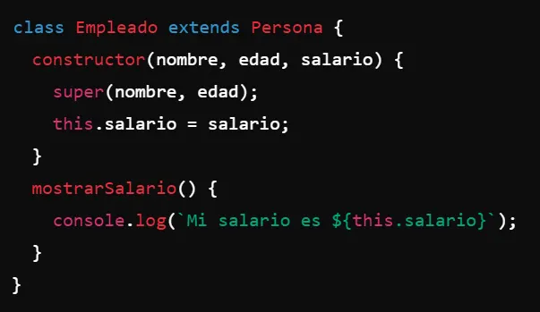
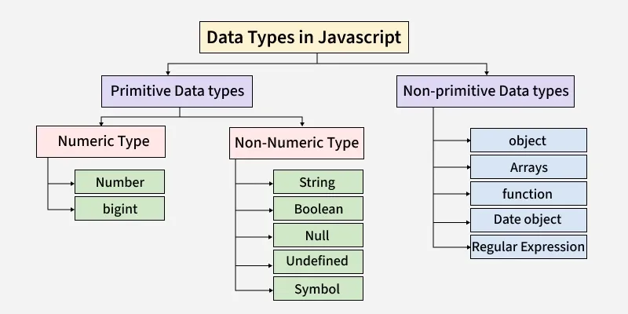
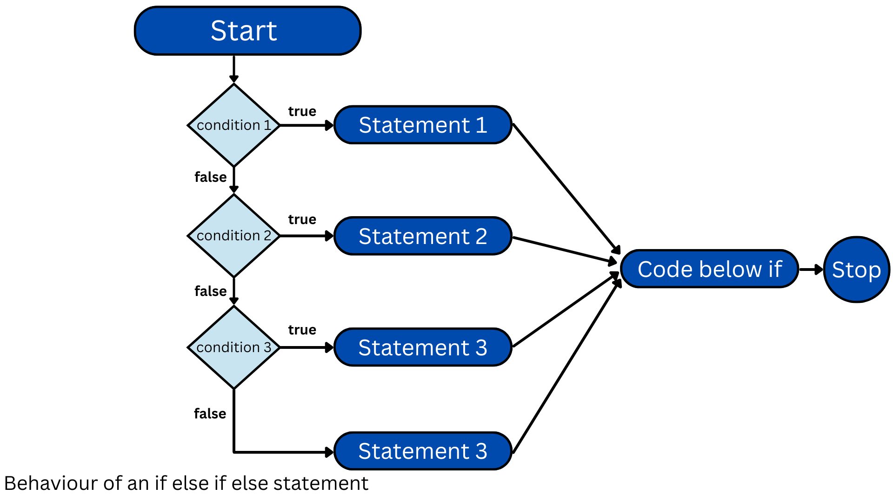
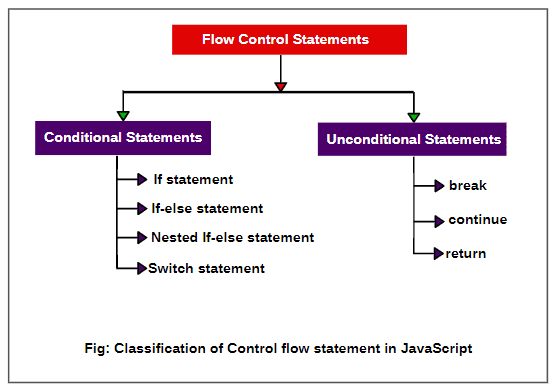
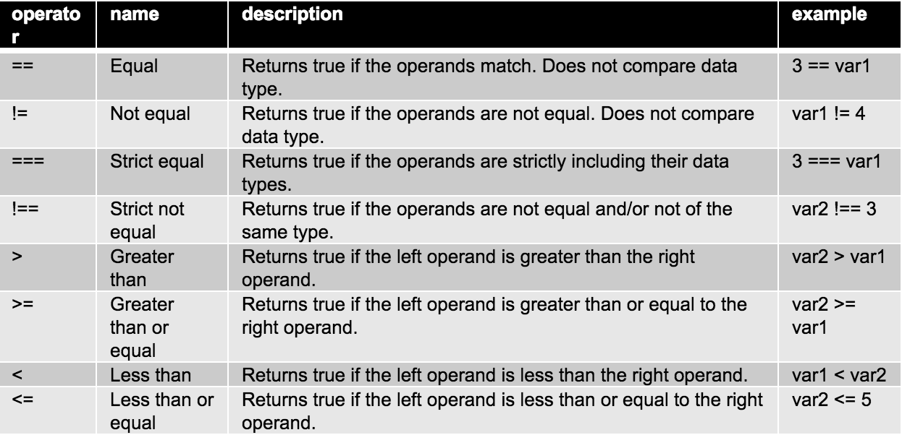
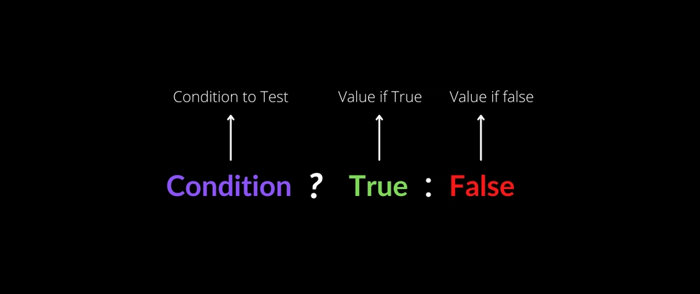
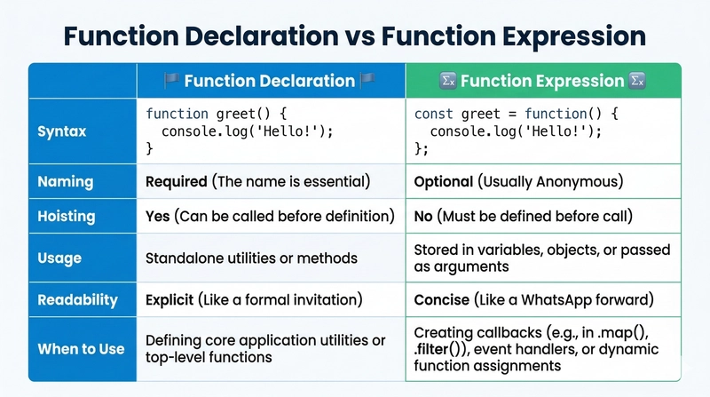
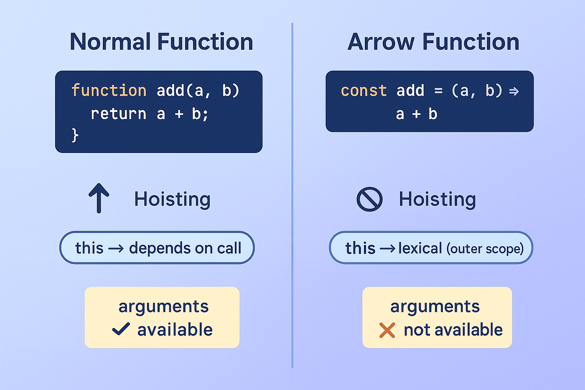
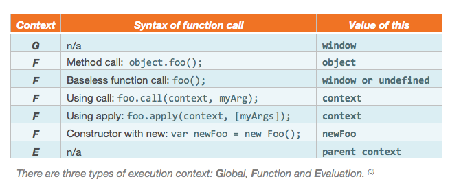

# CHECKPOINT 7

## ¿Qué diferencia a JavaScript de cualquier otro lenguaje de programación?

JavaScript se diferencia de otros lenguajes de programación por una combinación de características históricas, de ejecución y de diseño que lo hacen único, especialmente en el desarrollo web.

1.  JavaScript es el lenguaje nativo de los navegadores. Esto significa que se ejecuta directamente en el navegador del usuario sin necesidad de compilación previa ni instalación adicional. Ningún otro lenguaje tiene este nivel de integración universal en el entorno web. Por ejemplo, si escribes un pequeño script en JavaScript dentro de una página HTML, cualquier usuario puede ejecutarlo automáticamente al abrirla, mientras que lenguajes como Python o Java requieren entornos específicos.

    <figure><figcaption></figcaption></figure>
2. Es un lenguaje interpretado y dinámico. No necesitas declarar tipos de variables de forma estricta. Por ejemplo, puedes hacer algo como: let x = 10; y luego x = "hola"; sin errores. En lenguajes como Java, esto no es posible porque el tipo se fija desde el principio.
3. Utiliza un modelo basado en prototipos en lugar de clases tradicionales (aunque hoy en día incluye sintaxis de clases). Esto significa que los objetos pueden heredar directamente de otros objetos. Por ejemplo, puedes crear un objeto base y luego otro que herede de él sin necesidad de definir estructuras formales como en C++ o Java.
4. JavaScript es **asíncrono** por naturaleza y está diseñado para manejar eventos. Esto es clave en aplicaciones web. Por ejemplo, puedes hacer una petición a un servidor y continuar ejecutando código mientras esperas la respuesta usando funciones como fetch o promesas. En otros lenguajes, tradicionalmente el flujo es más secuencial, aunque hoy muchos han incorporado asincronía.
5.  Tiene funciones de primera clase. Esto significa que las funciones se pueden tratar como cualquier otra variable: se pueden asignar, pasar como argumento o devolver desde otras funciones. Por ejemplo, puedes hacer algo como: function saludar(nombre) { return "Hola " + nombre; } y luego pasar esa función a otra función para ejecutarla.

    <figure><figcaption></figcaption></figure>
6. JavaScript es multiparadigma. Puedes programar en estilo imperativo, orientado a objetos o funcional. Por ejemplo, puedes usar objetos con métodos (orientado a objetos) o funciones puras y map/reduce (funcional).
7. Su ecosistema es enorme, especialmente con entornos como Node.js que permiten usar JavaScript fuera del navegador, en servidores, herramientas de línea de comandos, aplicaciones móviles y más. Esto lo diferencia porque puedes usar el mismo lenguaje tanto en frontend como en backend.
8. Su modelo de ejecución es de un solo hilo con un event loop. Esto significa que no ejecuta múltiples hilos simultáneamente como otros lenguajes, pero puede manejar muchas operaciones concurrentes mediante eventos y callbacks. Por ejemplo, mientras espera una respuesta de red, puede seguir respondiendo a interacciones del usuario.

En resumen, JavaScript destaca por ser el lenguaje universal del navegador, dinámico, flexible, basado en prototipos, orientado a eventos y con un fuerte soporte para asincronía, lo que lo hace especialmente adecuado para aplicaciones interactivas y distribuidas.


## ¿Cuáles son algunos tipos de datos JS?

En JavaScript existen varios tipos de datos que se dividen en dos grandes categorías: primitivos y objetos (o tipos de referencia). Cada uno tiene comportamientos distintos en memoria, comparación y uso.

Los tipos de datos primitivos son los más básicos y se almacenan directamente como valores simples.

*   **Number** representa números, tanto enteros como decimales. Por ejemplo:&#x20;

    ```
    let a = 10; 
    let b = 3.14;
    ```

    También incluye valores especiales como _Infinity_, -&#x49;_&#x6E;finity_ y _NaN_ (Not a Number).&#x20;
*   **String** representa texto. Se puede escribir con comillas simples, dobles o backticks. Por ejemplo:

    ```
    let nombre = "Carlos"; 
    let saludo = 'Hola'; 
    let mensaje = Hola ${nombre};`
    ```

    Los strings son inmutables, lo que significa que no se modifican directamente, sino que se crean nuevos valores.
*   **Boolean** representa valores lógicos: _true_ o _false_. Se usa mucho en condiciones. Por ejemplo:&#x20;

    ```
    let esMayor = true; 
    let esValido = 5 > 3;
    ```

    En este caso, esValido será _true_.
*   **Undefined** es un tipo que indica que una variable ha sido declarada pero no tiene valor asignado. Por ejemplo:&#x20;

    ```
    let x;
    ```

    Aquí x es _undefined_ automáticamente.
*   **Null** representa la ausencia intencional de valor. Es diferente de _undefined_ porque se asigna explícitamente. Por ejemplo:&#x20;

    ```
    let usuario = null;
    ```

    Se suele usar cuando quieres indicar que una variable no tiene valor aún, pero lo tendrá más adelante.

<figure><figcaption></figcaption></figure>

*   **BigInt** permite representar números enteros muy grandes que superan el límite de _Number_. Por ejemplo:&#x20;

    ```
    let grande = 123456789012345678901234567890n;
    ```

    Se identifica porque termina con la letra n.
*   **Symbol** es un tipo único e inmutable que se usa principalmente para crear identificadores únicos en objetos. Por ejemplo:&#x20;

    ```
    let id = Symbol("id");
    ```

    Incluso si creas dos símbolos con la misma descripción, no son iguales.

Por otro lado, están los tipos de referencia u objetos. Aquí no se almacena el valor directamente, sino una referencia a una ubicación en memoria.

*   **Object** es el tipo base para estructuras más complejas. Por ejemplo:&#x20;

    ```
    let persona = { nombre: "Ana", edad: 25 };
    ```

    Puedes acceder a sus propiedades con _persona.nombre_.
*   **Array** es un tipo especial de objeto que permite almacenar colecciones ordenadas. Por ejemplo:

    ```
     let numeros = [1, 2, 3, 4];
    ```

    Puedes acceder con índices: _numeros\[0]_ es 1.
*   **Function** también es un tipo de objeto en JavaScript. Esto es importante porque permite tratarlas como valores. Por ejemplo:&#x20;

    ```
    function saludar() { 
    return "Hola"; 
    }
    ```

    o también:&#x20;

    ```
    const suma = function(a, b) {
     return a + b; 
     };
    ```
*   **Date** es un objeto para manejar fechas y horas. Por ejemplo:&#x20;

    ```
    let hoy = new Date();
    ```

Otros objetos importantes incluyen **Map** y **Set**.&#x20;

*   **Map** almacena pares clave-valor donde las claves pueden ser de cualquier tipo. Por ejemplo:&#x20;

    ```
    let mapa = new Map(); 
    mapa.set("clave", "valor");
    ```
*   **Set** almacena valores únicos:&#x20;

    ```
    let conjunto = new Set([1, 2, 2, 3]);
    ```

    Aquí el resultado será 1, 2, 3.

Una diferencia clave entre primitivos y objetos es cómo se copian. Los primitivos se copian por valor, mientras que los objetos se copian por referencia. Por ejemplo:&#x20;

```
let a = 5; let b = a; b = 10;
```

Aquí a sigue siendo 5. Pero con objetos:&#x20;

```
let obj1 = { x: 1 }; let obj2 = obj1; obj2.x = 2;
```

ahora _obj1.x_ también es 2.

En resumen, JavaScript tiene tipos simples como Number, String o Boolean, y tipos complejos como Object o Array, y entender cómo funcionan es clave para evitar errores y escribir código más eficiente.

## ¿Cuáles son las tres funciones de String en JS?

En JavaScript existen muchas funciones (métodos) para trabajar con strings, pero tres de las más usadas y representativas son **length**, **toUpperCase** y **slice**. Cada una sirve para manipular o analizar texto de forma distinta.

*   **length** - No es exactamente una función sino una propiedad, pero se usa constantemente para obtener la longitud de un string. Indica cuántos caracteres tiene una cadena. Por ejemplo:&#x20;

    ```
    let texto = "Hola"; texto.length
    ```

    Devuelve 4 porque la palabra tiene cuatro caracteres. Esto es útil cuando necesitas recorrer un string o validar su tamaño, por ejemplo en contraseñas.
*   **toUpperCase -** es una función que convierte todos los caracteres de un string a mayúsculas. No modifica el string original, sino que devuelve uno nuevo. Por ejemplo:&#x20;

    ```
    let saludo = "hola mundo"; let resultado = saludo.toUpperCase();
    ```

    Resultado será "HOLA MUNDO". Esto se usa mucho para normalizar texto antes de compararlo, por ejemplo:&#x20;

    ```
    if (usuario.toUpperCase() === "ADMIN") { ... }
    ```
*   **slice -** es una función que permite extraer una parte de un string indicando posiciones de inicio y fin. El índice inicial se incluye, pero el final no. Por ejemplo:&#x20;

    ```
    let palabra = "JavaScript"; palabra.slice(0, 4)
    ```

    Devuelve "Java". Si haces _palabra.slice(4_), devuelve desde esa posición hasta el final, en este caso "Script". También acepta índices negativos para contar desde el final: _palabra.slice(-6)_ devuelve "Script".

Estas tres herramientas cubren necesidades muy comunes: saber el tamaño del texto, transformarlo y extraer partes específicas. Aunque hay muchas más funciones en JavaScript para strings como includes, replace o split, dominar estas tres es clave para empezar a trabajar eficazmente con texto.

<figure><figcaption></figcaption></figure>


## ¿Qué es un condicional?

> Un condicional en JavaScript es una estructura de control que permite tomar decisiones dentro del programa. Sirve para ejecutar un bloque de código u otro dependiendo de si se cumple una condición. Esa condición normalmente es una expresión que devuelve un valor booleano, es decir, true o false.

*   El condicional más básico es **if**. Evalúa una condición y, si es verdadera, ejecuta el código dentro de su bloque. Por ejemplo:&#x20;

    ```
    let edad = 18; 
    if (edad >= 18) {
     console.log("Eres mayor de edad"); 
    }
    ```

    En este caso, como la condición edad >= 18 es true, el mensaje se ejecuta.
*   También existe **if - else**, que permite ejecutar un bloque alternativo si la condición no se cumple. Por ejemplo:&#x20;

    ```
    let edad = 16;
    if (edad >= 18) {
     console.log("Eres mayor de edad"); 
    } else {
     console.log("Eres menor de edad"); 
    }
    ```

    Aquí se ejecuta el bloque else porque la condición es false.
*   Otra variante es **else if**, que permite evaluar múltiples condiciones en cadena. Por ejemplo:&#x20;

    ```
    let nota = 7; 
    if (nota >= 9) {
     console.log("Sobresaliente"); 
    } else if (nota >= 6) { 
     console.log("Aprobado"); 
    } else { console.log("Suspenso"); 
    }
    ```

    JavaScript evalúa cada condición en orden y ejecuta el primer bloque cuya condición sea verdadera.

<figure><figcaption></figcaption></figure>

*   El condicional **switch**, que se utiliza cuando hay múltiples casos posibles para una misma variable. Por ejemplo:&#x20;

    ```
    let dia = 2; 
    switch (dia) {
     case 1: 
       console.log("Lunes");
       break; 
     case 2: 
       console.log("Martes"); 
       break; 
     default: 
       console.log("Otro día"); 
    }
    ```

    Aquí se compara el valor de dia con cada caso. El _break_ es importante porque evita que se ejecuten los siguientes casos.

<figure><figcaption></figcaption></figure>

*   También existe el operador ternario, que es una forma abreviada de escribir un _if-else._ Su sintaxis es:&#x20;

    ```
    condición ? valorSiTrue : valorSiFalse
    ```

    Por ejemplo:&#x20;

    ```
    let edad = 20; let mensaje = edad >= 18 ? "Adulto" : "Menor";
    ```

    Esto hace lo mismo que un if-else pero en una sola línea.

Un detalle importante es que las condiciones pueden usar operadores de comparación como ==, ===, !=, !==, >, <, >=, <=. El operador === es especialmente importante porque compara valor y tipo, mientras que == solo compara el valor con conversión de tipo.

<figure><figcaption></figcaption></figure>

En resumen, los condicionales en JavaScript permiten controlar el flujo del programa tomando decisiones basadas en condiciones lógicas, y son fundamentales para crear programas dinámicos e interactivos.

## ¿Qué es un operador ternario?

> El operador ternario en JavaScript es una forma abreviada de escribir una estructura condicional simple, similar a un _if-else_. Se utiliza para evaluar una condición y devolver un valor dependiendo de si esa condición es verdadera o falsa.

Se llama “ternario” porque utiliza tres partes: una **condición**, una **expresión** si la condición es _verdadera_, y **otra expresión** si es _falsa_. Su sintaxis general es:&#x20;

<figure><figcaption></figcaption></figure>

Por ejemplo, en lugar de escribir un _if-else_ completo como:

```
let edad = 20;
let mensaje;
if (edad >= 18) {
    mensaje = "Adulto"; 
} else {
    mensaje = "Menor"; 
}
```

puedes escribirlo con operador ternario así:&#x20;

```
let edad = 20; 
let mensaje = edad >= 18 ? "Adulto" : "Menor"; 
```

En este caso, como la condición _edad >= 18_ es _true_, el resultado será "Adulto".

El operador ternario también puede usarse dentro de expresiones más complejas. Por ejemplo:&#x20;

```
let puntuacion = 85; 
let nivel = puntuacion > 90 ? "Alto" : puntuacion > 70 ? "Medio" : "Bajo";
```

En este caso hay ternarios anidados. Primero evalúa si es _mayor que_ 90; si no, evalúa si es _mayor que_ 70, y así sucesivamente.

*   También se puede usar directamente en funciones o retornos. Por ejemplo:&#x20;

    ```
    function saludar(nombre) { return nombre ? "Hola " + nombre : "Hola invitado"; }
    ```

    Aquí, si nombre tiene un valor válido, se usa; si no, se devuelve un saludo genérico.

Es importante no abusar del operador ternario, ya que si se encadenan muchos puede dificultar la lectura del código. Para condiciones simples es muy útil y hace el código más compacto, pero para lógica más compleja es mejor usar _if-else_ tradicional.

## ¿Cuál es la diferencia entre una declaración de función y una expresión de función?

> La diferencia entre una declaración de función y una expresión de función en JavaScript está principalmente en cómo se definen, cómo se interpretan por el motor de JavaScript y cuándo pueden ser utilizadas en el código.

*   Una declaración de función (function declaration) es una forma de definir funciones usando la palabra clave function seguida de un nombre. Por ejemplo:&#x20;

    ```
    function saludar() { return "Hola"; }
    ```

    Esta función tiene un nombre obligatorio y se “eleva” o hoisting, lo que significa que puedes llamarla antes de haberla declarado en el código. Por ejemplo:&#x20;

    ```
    saludar(); 
    function saludar() { return "Hola"; }
    ```

    Esto funciona correctamente porque JavaScript carga la función completa en memoria antes de ejecutar el código.
*   En cambio, una expresión de función (function expression) consiste en asignar una función a una variable. Por ejemplo:&#x20;

    ```
    const saludar = function() { return "Hola"; };
    ```

    En este caso, la función puede ser **anónima** (sin nombre) o tener un nombre interno, pero lo importante es que se trata como un valor asignado. A diferencia de la declaración, esta no se eleva completamente. Solo la variable se eleva (si es var), pero no su contenido. Por ejemplo:


    ```
    saludar(); const saludar = function() { return "Hola"; };`
    ```

    Esto genera un error porque la variable aún no tiene asignada la función en el momento de la llamada.

Otra diferencia importante es el uso en contexto. Las expresiones de función son muy útiles cuando quieres pasar funciones como argumentos o usarlas dentro de otras funciones.&#x20;

```
setTimeout(function() { console.log("Hola"); }, 1000);
```

Aquí se usa una función anónima como expresión.

<figure><figcaption></figcaption></figure>

Además, las funciones flecha (arrow functions) son un tipo especial de expresión de función. &#x20;

```
const suma = (a, b) => a + b;
```

Estas también son expresiones, no declaraciones, y tienen un comportamiento diferente.

También hay diferencias en el ámbito. Las declaraciones de función se definen en el "scope" actual y son accesibles en todo ese bloque (o función contenedora), mientras que las expresiones dependen de la variable a la que están asignadas.

<figure><figcaption></figcaption></figure>

En resumen, la declaración de función se define de forma directa y se puede usar antes de su aparición en el código gracias al "hoisting" completo, mientras que la expresión de función se trata como un valor asignado a una variable y solo puede usarse después de haber sido definida, lo que la hace más flexible en ciertos contextos como callbacks o programación funcional.

## Qué es la palabra clave "this" en JS?

> La palabra clave **this** en JavaScript es una referencia que apunta al contexto de ejecución actual, es decir, al objeto al que pertenece el código que se está ejecutando en ese momento. Su valor no es fijo, sino que depende de cómo se llama la función.

En el contexto global, this hace referencia al objeto global. Por ejemplo:&#x20;

```
console.log(this);
```

Mostrará el objeto global cuando se ejecuta fuera de cualquier función.

* Dentro de un objeto, **this** se refiere al propio objeto cuando se usa en uno de sus métodos.&#x20;

```
let persona = {
    nombre: "Ana",
    saludar: function() { 
        return "Hola, soy " + this.nombre; 
        } 
    }; 
persona.saludar();
```

En este caso, _this.nombre_ hace referencia a la propiedad nombre del objeto persona.

* En funciones normales (no dentro de objetos), el valor de **this** depende de cómo se invoca la función. Si se llama como función simple, este suele ser el objeto global (o _undefined_ en modo estricto).&#x20;

```
function mostrar() { 
    console.log(this); 
} 
mostrar();
```

Aquí **this** no apunta a un objeto específico definido por el usuario.

* Cuando se usa en un constructor con la palabra clave **new**, _this_ hace referencia al nuevo objeto que se está creando. Por ejemplo:&#x20;

```
function Persona(nombre) {
    this.nombre = nombre; 
} 
let p = new Persona("Luis");
```

<figure><figcaption></figcaption></figure>

Aquí this apunta al objeto "p" recién creado.

* Un caso importante es con las funciones flecha. Las funciones _arrow_ no tienen su propio **this**, sino que heredan el _this_ del contexto en el que fueron definidas. Por ejemplo:&#x20;

```
let persona = { nombre: "Carlos",
    saludar: function() { 
        const f = () => 
            this.nombre; return f(); 
    } 
}; 
persona.saludar();
```

Aquí la función _arrow_ usa el mismo _this_ que la función saludar, es decir, persona.

También se puede controlar explícitamente el valor de **this** usando métodos como _call_, _apply_ o _bind_. &#x20;

```
function saludar() {
    return "Hola " + this.nombre; 
}
let usuario = { nombre: "Marta" }; 
saludar.call(usuario); 
```

Aquí se fuerza a que _this_ sea usuario.

En resumen, **this** es una palabra clave que representa el contexto actual de ejecución y su valor depende de cómo se llama la función, no de dónde se define, lo que puede resultar confuso al principio pero es fundamental para trabajar con objetos y funciones en JavaScript.

